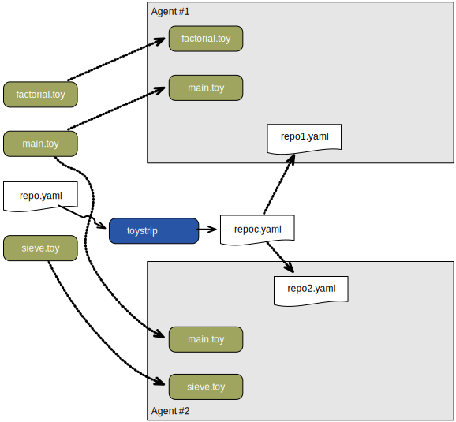
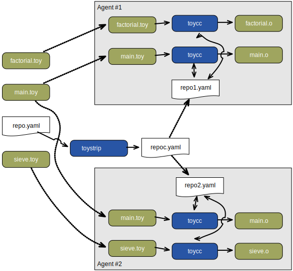
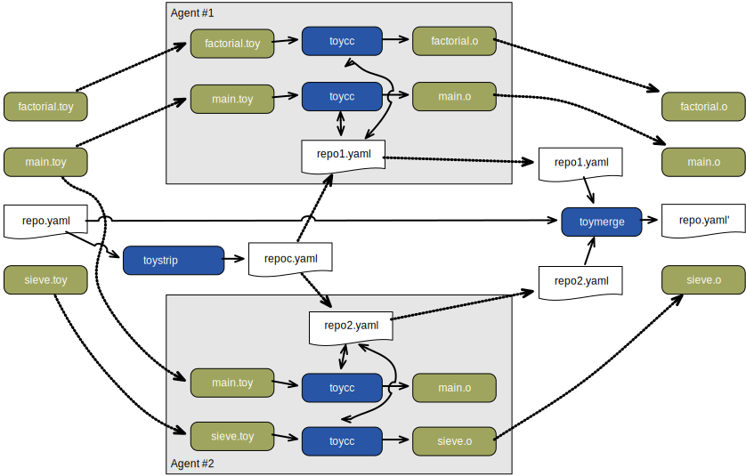
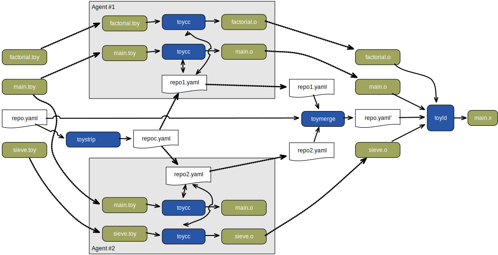

# Distributed Sample

This sample program is intended to simulate the use of the program repository in a distributed environment such as distcc or SN DBS. In this sample two directories, `agent1/` and `agent2/` act in the stead of two remote agents, agent #1 and agent #2. 

The program consists of three small source files, `factorial.toy`, `sieve.toy`, and `main.toy`. Agent #1 compiles `factorial.toy` and `main.toy` placing the resulting object files and repository in `agent1/`; agent #2 compiles `sieve.toy` and `main.toy` with the results in `agent2/`. `main.toy` is deliberately compiled by both agents but only the version compiled on agent #1 is used in the link.

The link itself is performed in the sample's root directory, drawing the three object files to be linked as well as the two repositories from the two agents' directories. 

The steps below illustrate how the source files are "remotely" compiled by the agents and linked on the host to produce the executable (`main.tx`). The use of directories to simulate the agents means that no files are physically copied from host to agent and vice versa. Hopefully, despite this divergence from the real system, the intent of example is clear.

## Step-by-step workflow

Note that the steps described below are intended to be stricitly illustrative. Although the operations being described will be carried out, the order in which that happens may differ from the description below.

I assume that the distributed build is performed on two remote agents.

### 1. Preparation

The stage prepares the build for building on the remote agents. The three source files are copied to their respective destinations. In this example I'm showing `main.toy` being compiled twice, once per agent. This reflects the behavior of some distributed build systems which can distribute a file to multiple agents and use the result that is produced first.

The program repository, if present, is passed to `toystrip`. This tool produces a copy of the repository without any of the contents of its fragments; only the digests are left behind. This, dramatically smaller, version of the repository is pushed to the remote agents. By taking advantage of the property that the compiler only looks for the digest keys to determine whether it needs to continue processing a given function we minimize the unnecessary work carried out by the compiler and also transfer relatively little additional data over the network.

### 2. Compilation

Compilation proceeds as normal. The compilers read and write from their local repositories.

### 3. Copy back

Once compilation has been completed, each agent has a pair of ticket files and an updated repository containing the definitions of new and modified functions. Both repositories and one copy of each of the three object files is copied back to the host.

We now have three repositories: the original (repo.yaml) and one from each of the remove agents (repo1.yaml and repo2). The `toymerge` tool is now run to copy and new definitions from the remotely generated repositories are added to the original copy to produce a new version of repo.yaml. The 

### 4. Link

Finally, the link is carried out as normal.

