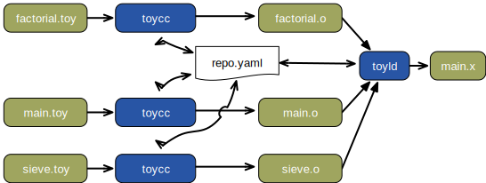

Modules Sample
====
This sample takes a small program which consists of three related source files (`main.toy`, `factorial.toy`, and `sieve.toy`) which together form a complete program.

The basic build process follows the same general pattern as would be found in a traditional C/C++ compilation system. Each source file is individually compiled but the compiler uses a common program repository (`repo.yaml`) to record the definitions of the functions that they each define. The linker draws its inputs directly from the repository, guided by the "ticket files" that are produced by each compilation.

The sequence of operations is identical to that of a standard compilation:

    $ make
    toycc -o main.o -g  main.toy
    toycc -o factorial.o -g  factorial.toy
    toycc -o sieve.o -g sieve.toy
    toyld  -o main.x  main.o factorial.o sieve.o
    $

Note that the tools use a default location and name for the repository (./repo.yaml). This can be overidden for more complex builds. (Note that the use of YAML for the repository precludes the possibility of performing these builds in parallel. Obviously, this restriction would be lifted in a production system.

